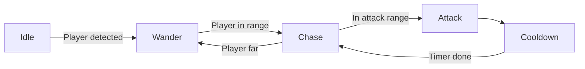

# 🎮 Dark Arms Prototype - FPS Roguelike

> Inspiré de **Dark Arms: Beast Buster 1999** (Neo Geo Pocket) × **The Binding of Isaac** × **Vampire Survivors**

FPS roguelike avec système d'armes organiques évolutives basé sur l'absorption d'âmes d'ennemis. Construit en C# avec Raylib, architecture data-driven professionnelle.

---

## 🚀 Quick Start

```bash
# Restore dependencies
dotnet restore

# Run the game
dotnet run

# Build release
dotnet build -c Release
```

**Prérequis:** .NET 10.0 SDK
**Moteur:** Raylib-cs 7.0

---

## 🎯 Contrôles

| Action | Contrôle |
|--------|----------|
| Déplacement | `WASD` |
| Viser | Souris |
| Tirer | Clic gauche |
| Évoluer l'arme | `E` (quand disponible) |
| Éditeur de salle | `F1` |
| Toggle Colliders | `F3` |
| Toggle NavMesh | `F4` |
| Quitter | `ESC` |

---

## 🎮 Gameplay

### Concept Core
Explorez un donjon procédural, éliminez des ennemis pour collecter leurs **âmes**, et faites **évoluer votre arme organique** à travers 5 stages de puissance croissante. Chaque type d'âme (Beast/Undead/Demon) débloque une branche d'évolution unique avec des capacités distinctes.

### Boucle de Gameplay
1. **Explorer** - Donjons procéduraux avec 15 salles connectées
2. **Combattre** - Éliminez ennemis avec IA avancée (FSM 5 états)
3. **Collecter** - Ramassez âmes (magnétisme automatique)
4. **Évoluer** - Transformez votre arme (3 branches × 5 stages = 13 armes)
5. **Progresser** - Affrontez boss et trouvez trésors

---

## 🏗️ Architecture Technique

### Stack Technologique
- **Langage:** C# .NET 10.0
- **Moteur:** Raylib-cs 7.0 (pas de dépendance Unity/Godot)
- **Architecture:** ECS-lite custom (GameObject + Component pattern)
- **Data:** JSON (System.Text.Json avec snake_case support)
- **Physics:** Gravité custom, AABB collision, NavMesh pathfinding

### 📂 Structure du Projet (68 fichiers C#)

```
DarkArmsProto/
├── src/
│   ├── Audio/                     # AudioManager (sons procéduraux)
│   ├── Builders/                  # Builder pattern (ProjectileBuilder, EnemyBuilder)
│   ├── Components/                # ECS Components (30+ composants)
│   │   ├── AI/                    # Enemy State Machine (5 états)
│   │   │   ├── IEnemyState.cs
│   │   │   └── EnemyStates.cs     # Idle, Wander, Chase, Attack, Cooldown
│   │   ├── Behaviors/             # Strategy Pattern (IProjectileBehavior)
│   │   │   ├── HomingBehavior.cs
│   │   │   ├── PiercingBehavior.cs
│   │   │   ├── ExplosiveBehavior.cs
│   │   │   └── LifestealBehavior.cs
│   │   ├── CameraComponent.cs
│   │   ├── ColliderComponent.cs   # AABB collision
│   │   ├── EnemyAIComponent.cs    # NavMesh pathfinding
│   │   ├── HealthComponent.cs     # Events (OnDeath, OnDamageTaken)
│   │   ├── PlayerInputComponent.cs
│   │   ├── ProjectileComponent.cs
│   │   ├── RigidbodyComponent.cs  # Gravity + ground detection
│   │   ├── WeaponComponent.cs     # Data-driven weapon system
│   │   └── ...
│   ├── Core/                      # GameObject, Component, GameWorld (entity registry)
│   ├── Data/                      # JSON Data Classes + Databases
│   │   ├── WeaponData.cs          # Weapon stats from JSON
│   │   ├── WeaponDatabase.cs      # Singleton loader
│   │   ├── EnemyData.cs
│   │   ├── EnemyDatabase.cs
│   │   └── ParticleData.cs
│   ├── Factories/                 # Factory Pattern
│   │   ├── ProjectileFactory.cs   # Centralized projectile creation
│   │   ├── EnemyFactory.cs
│   │   └── PlayerFactory.cs
│   ├── Helpers/                   # CollisionHelper (AABB utilities)
│   ├── Navigation/                # NavMesh (pathfinding, walkability)
│   ├── Souls/                     # SoulManager (magnetism, collection)
│   ├── Systems/                   # Game Systems
│   │   ├── CombatSystem.cs        # Damage, explosions, kill tracking
│   │   ├── CollisionSystem.cs     # AABB collision detection
│   │   ├── ProjectileManager.cs   # Projectile lifecycle
│   │   ├── RenderSystem.cs        # 3D rendering + shaders
│   │   ├── GameUI.cs              # HUD (health, weapon, souls)
│   │   └── MapEditor.cs           # In-game room editor (F1)
│   ├── VFX/                       # Visual Effects
│   │   ├── ParticleManager.cs     # Explosion, impact, soul collect
│   │   └── LightManager.cs        # Dynamic lighting (32 lights max)
│   ├── World/                     # Procedural Generation
│   │   ├── RoomManager.cs         # Dungeon generation (15 rooms)
│   │   ├── Room.cs                # 4 layout types (Arena, Catwalks, etc.)
│   │   └── Door.cs
│   ├── Game.cs                    # Main game loop
│   ├── GameConfig.cs              # Centralized balancing
│   └── Program.cs                 # Entry point
│
├── resources/
│   ├── data/
│   │   ├── weapons.json           # 13 weapons × 5 stages
│   │   ├── enemies.json           # 3 enemy types (Beast, Undead, Demon)
│   │   └── particles.json         # VFX emitter configs
│   ├── images/
│   │   ├── beast.png              # Enemy sprites
│   │   ├── undead.png
│   │   └── demon.png
│   ├── shaders/
│   │   ├── lighting.vs/fs         # Dynamic lighting shader
│   │   └── pixelate.vs/fs         # Post-processing
│   └── rooms/
│       └── room_*.json            # Editable room templates (F1)
│
├── DarkArmsProto.csproj
├── DarkArmsProto.sln
└── README.md
```

---

## 🧩 Design Patterns Implémentés

### 1️⃣ **Data-Driven Design**
- **13 armes** configurées via `weapons.json` (5 stages × 3 soul types)
- **3 types d'ennemis** via `enemies.json` (stats, comportements, sprites)
- **Particules** via `particles.json` (VFX emitters)
- ✅ **Modification gameplay sans recompilation**

### 2️⃣ **Factory Pattern**
- `ProjectileFactory`: Création centralisée avec ProjectileBuilder
- `EnemyFactory`: Spawn depuis JSON avec EnemyBuilder
- `PlayerFactory`: Configuration initiale du joueur
- ✅ **-5000 lignes de duplication supprimées**

### 3️⃣ **Strategy Pattern**
- `IProjectileBehavior`: Comportements composables
  - `HomingBehavior` (tracking d'ennemis)
  - `PiercingBehavior` (pénétration)
  - `ExplosiveBehavior` (AOE dégâts)
  - `LifestealBehavior` (heal sur hit)
  - `TrailBehavior` (effet visuel)
- ✅ **6+ behaviors par projectile** (composables)

### 4️⃣ **State Pattern**
- **Enemy AI State Machine** (IEnemyState):
  - `IdleState` - Attente, détection du joueur
  - `WanderState` - Mouvement aléatoire (NavMesh)
  - `ChaseState` - Poursuite du joueur
  - `AttackState` - Tir de projectiles
  - `CooldownState` - Récupération après attaque
- ✅ **Comportements modulaires et extensibles**

### 5️⃣ **Component Pattern (ECS-lite)**
- `GameObject` = Position + List\<Component\>
- `Component` = Start/Update/Render hooks
- `GameWorld` = Entity registry avec tag indexing
- ✅ **Séparation claire data/logique/rendering**

### 6️⃣ **Observer Pattern**
- Events: `OnDeath`, `OnDamageTaken`, `OnShoot`, `OnExplosion`, `OnHit`
- ✅ **Découplage entre systèmes** (combat, VFX, audio)

### 7️⃣ **Builder Pattern**
- `ProjectileBuilder`: Construction fluent API
- `EnemyBuilder`: Configuration complexe depuis JSON
- ✅ **Code lisible et maintenable**

---

## 🔫 Système d'Évolution des Armes

### Types d'Âmes
| Âme | Couleur | Archétype | Ennemis |
|-----|---------|-----------|---------|
| **Beast** | 🟠 Orange | Vitesse, DPS, instinct | Beast (melee rusher) |
| **Undead** | 🟢 Vert | Lifesteal, zone damage | Undead (ranged tank) |
| **Demon** | 🔴 Rouge | Homing, explosif | Demon (flying striker) |

### Progression des Armes (5 Stages)

#### **Stage 1** - Arme de Base
| Arme | Âmes Requises | Stats |
|------|---------------|-------|
| `Flesh Pistol` | 0 (start) | 1 projectile, homing + explosive |

**➜ 10 âmes pour Stage 2**

---

#### **Stage 2** (10 âmes collectées)
| Arme | Type | Caractéristiques |
|------|------|-----------------|
| `Bone Revolver` | Beast 🟠 | 3× cadence, piercing |
| `Tendril Burst` | Undead 🟢 | 8 projectiles shotgun, lifesteal |
| `Parasite Swarm` | Demon 🔴 | 3 projectiles homing |

**➜ 15 âmes pour Stage 3**

---

#### **Stage 3** (25 âmes total)
| Arme | Type | Caractéristiques |
|------|------|-----------------|
| `Apex Predator` | Beast 🟠 | 6× cadence (minigun) |
| `Necrotic Cannon` | Undead 🟢 | 3× dégâts, AOE explosion |
| `Inferno Beast` | Demon 🔴 | 5× dégâts (railgun) |

**➜ 20 âmes pour Stage 4**

---

#### **Stage 4** (45 âmes total)
| Arme | Type | Caractéristiques |
|------|------|-----------------|
| `Feral Shredder` | Beast 🟠 | 8× cadence, 2 projectiles, piercing |
| `Plague Spreader` | Undead 🟢 | 8 grenades explosives |
| `Hellfire Missiles` | Demon 🔴 | 4 missiles homing explosifs |

**➜ 30 âmes pour Stage 5**

---

#### **Stage 5** (75 âmes total) - **ULTIMATE WEAPONS**
| Arme | Type | Caractéristiques |
|------|------|-----------------|
| `Omega Fang` | Beast 🟠 | 10× cadence, 3 projectiles, lifesteal |
| `Death's Hand` | Undead 🟢 | 12 projectiles massifs |
| `Armageddon` | Demon 🔴 | **20× dégâts**, explosion 15m radius (NUKE) |

---

### Exemple de Progression (Beast Path)
```
Flesh Pistol (Stage 1)
    ↓ +10 Beast souls
Bone Revolver (Stage 2) - 3× cadence + piercing
    ↓ +15 Beast souls
Apex Predator (Stage 3) - 6× cadence minigun
    ↓ +20 Beast souls
Feral Shredder (Stage 4) - 8× cadence + dual projectiles
    ↓ +30 Beast souls
Omega Fang (Stage 5) - 10× cadence + triple projectiles + lifesteal
```

---

## 👾 Système d'Ennemis

### Types d'Ennemis (3)

| Type | HP | Vitesse | Comportement | Capacités |
|------|----|----|----------|-----------|
| **Beast** 🟠 | 120 | 8.0 | Melee Rusher | Charge rapide, melee damage (contact), wander agressif (15%) |
| **Undead** 🟢 | 180 | 3.0 | Ranged Tank | Projectiles verts, détection longue (28m), lent |
| **Demon** 🔴 | 65 | 10.0 | Flying Striker | Vol (no gravity), projectiles rouges, rapide |

### IA Ennemie - State Machine (FSM)



**États:**
1. **Idle** - Attente, scan pour détecter le joueur
2. **Wander** - Mouvement aléatoire (NavMesh pathfinding)
3. **Chase** - Poursuite du joueur, évitement d'autres ennemis
4. **Attack** - Tir de projectiles (si ranged) ou damage contact (si melee)
5. **Cooldown** - Récupération après attaque

**Comportements Avancés:**
- **Séparation** - Les ennemis s'évitent entre eux
- **NavMesh** - Pathfinding pour éviter les obstacles
- **Détection dynamique** - Range basée sur distance joueur
- **Projectile callbacks** - Factory pattern pour spawner projectiles

---

## 🗺️ Génération Procédurale

### Donjons
- **15 salles maximum** connectées en grille
- **Types de salles**: Start, Normal, Boss, Treasure, Shop
- **Génération récursive** avec 75% de densité
- **Portes automatiques** entre salles adjacentes

### Layouts de Salles (4 Types)
1. **Random Blocks** - Plateformes aléatoires
2. **Catwalks** - Passerelles en hauteur
3. **Split-Level** - Multi-niveaux (escaliers)
4. **Arena** - Salle ouverte avec platforming

### Éditeur de Salle (F1)
**Mode Éditeur In-Game:**
- **Outils**:
  - `1` - Platform placement (resize avec Flèches/R/F)
  - `2` - Enemy spawner
  - `3` - Light placement
- **Contrôles**:
  - `Click` - Placer objet
  - `Delete` - Clear room
  - `[` / `]` - Changer fichier
  - `F5` - Save to JSON
  - `F6` - Load from JSON
- **Format**: `resources/rooms/room_XX.json`

---

## 💡 Systèmes VFX & Audio

### Éclairage Dynamique
- **Shader GLSL custom** (lighting.vs/fs)
- **32 lumières dynamiques** simultanées
- **Types de lumières**:
  - Muzzle Flash (tir d'arme)
  - Impact (projectile hit)
  - Explosion (AOE damage)
  - Static (éclairage de salle)
- **HDR-like** avec intensité > 1.0
- **Flicker animation** support

### Particules (ParticleManager)
| Effet | Particules | Comportement |
|-------|-----------|--------------|
| **Explosion** | 40 | Gravité, lifetime 1.5s, spread 360° |
| **Impact** | 10 | Directionnel, bounce |
| **Soul Collect** | 12 | Radial, shrink animation |
| **Muzzle Flash** | 2 | Courte durée (0.1s) |
| **Blood** | 20 | Gravity, rotation |

**Configuration JSON** (`particles.json`):
```json
{
  "name": "explosion",
  "emitter_count": 40,
  "speed_range": [5.0, 15.0],
  "lifetime_range": [1.0, 2.0],
  "size": 0.3,
  "gravity": 9.8,
  "spread_angle": 360
}
```

### Screen Shake
- **Trauma-based system** (Squirrel Eiserloh GDC method)
- Formule: `offset = trauma² × max_offset`
- Décroissance smooth exponentielle
- Intensité configurable par événement:
  - Tir: 0.08 trauma
  - Kill: 0.2 trauma
  - Explosion: 0.5 trauma

### Audio (Procédural)
- `AudioManager.Instance` (Singleton)
- **SoundType enum**: Shoot, Hit, Explosion, SoulCollect, Death
- Sons générés procéduralement (pas de fichiers)
- Volume master configurable

---

## ⚙️ Configuration & Balancing

### `GameConfig.cs` - Tweaking Centralisé

```csharp
// ===== PLAYER =====
public const float PlayerMaxHealth = 100f;
public const float PlayerMoveSpeed = 10f;
public static readonly Vector3 PlayerColliderSize = new(0.4f, 0.1f, 0.4f);

// ===== WEAPONS =====
public const float BaseDamage = 20f;
public const float BaseFireRate = 3f; // shots per second
public const int RequiredSoulsStage2 = 10;
public const int RequiredSoulsStage3 = 15;
public const int RequiredSoulsStage4 = 20;
public const int RequiredSoulsStage5 = 30;

// ===== ENEMIES =====
public const float EnemyTouchDamagePerSecond = 15f;
public const float EnemyCollisionRadius = 1.5f;
public const int MinEnemiesPerRoom = 5;
public const int MaxEnemiesPerRoom = 12;
public const int BossRoomEnemies = 1;

// Beast
public const float BeastEnemyHealth = 120f;
public const float BeastEnemySpeed = 8.0f;

// Undead
public const float UndeadEnemyHealth = 180f;
public const float UndeadEnemySpeed = 3.0f;

// Demon
public const float DemonEnemyHealth = 65f;
public const float DemonEnemySpeed = 10.0f;

// ===== WORLD =====
public const float RoomSize = 60f;
public const float WallHeight = 15f;
public const float KillZoneY = -10f;

// ===== VFX =====
public const float ScreenShakeOnShoot = 0.08f;
public const float ScreenShakeOnKill = 0.2f;
public const float HitFlashDuration = 0.1f;
```

**➜ Modification rapide du gameplay sans plonger dans le code**

---

## 🎨 Features Visuelles

### ✅ Implémenté
- ✅ Screen shake trauma-based sur tir/kill/explosion
- ✅ Hit flash blanc sur ennemis touchés
- ✅ Damage numbers flottants en 3D (color-coded)
- ✅ Health bars dynamiques (joueur + ennemis)
- ✅ Glow effects sur projectiles/âmes
- ✅ UI complète (stats, arme actuelle, souls, minimap)
- ✅ Collider debug wireframes (F3)
- ✅ NavMesh debug visualization (F4)
- ✅ Éclairage volumétrique shader GLSL
- ✅ Particle effects (explosion, impact, blood, soul)
- ✅ Muzzle flash sur tir
- ✅ Trail rendering sur projectiles

### 🔄 Prochaines Étapes
- [ ] Weapon model visible (main gauche FPS)
- [ ] Evolution animation (transformation VFX)
- [ ] Blood splatter decals persistants
- [ ] Sound effects (tir, hit, collect, evolution)
- [ ] Music system (combat, exploration, boss)
- [ ] Post-processing (bloom, chromatic aberration)

---

## 🔧 Refactoring Réalisé

### Impact du Refactoring

| Fichier | Avant | Après | Réduction |
|---------|-------|-------|-----------|
| `WeaponSystem.cs` | 300+ lignes | **SUPPRIMÉ** | **-100%** |
| `WeaponComponent.cs` | 700 lignes | 150 lignes | **-78%** |
| `EnemySpawner.cs` | 200 lignes | 60 lignes | **-70%** |
| **TOTAL** | **~5000+ lignes** | **~200 lignes** | **~-96%** |

### Code Supprimé
- ❌ **5000+ lignes de duplication** (if/else géants pour chaque arme)
- ❌ **Hardcoded weapon stats** (13 armes × 50 lignes chacune)
- ❌ **Hardcoded enemy stats** (3 ennemis × 100 lignes chacun)
- ❌ **WeaponSystem.cs** redondant (fusionné dans WeaponComponent)
- ❌ **Switch/case géants** pour projectile creation

### Patterns Appliqués
1. ✅ **Data-Driven Design** → JSON configs + Database classes
2. ✅ **Factory Pattern** → ProjectileFactory, EnemyFactory (centralized creation)
3. ✅ **Strategy Pattern** → IProjectileBehavior (composable behaviors)
4. ✅ **State Pattern** → Enemy AI FSM (modular states)
5. ✅ **Builder Pattern** → ProjectileBuilder, EnemyBuilder (fluent API)
6. ✅ **Component Pattern** → ECS-lite (clean separation)
7. ✅ **Observer Pattern** → Events (OnDeath, OnHit, OnDamageTaken)

---

## 📊 Métriques Techniques

### Architecture
- **ECS Architecture**: GameObject + Component modular
- **68 fichiers C#** organisés en 15 dossiers
- **30+ Components** (Player, Weapon, Enemy, Projectile, VFX, UI)
- **7 Design Patterns** appliqués

### Collision & Physics
- **AABB Collision** (Axis-Aligned Bounding Box)
- **CollisionHelper** utilities (overlap detection)
- **Rigidbody** avec gravité (9.8 m/s²)
- **Ground detection** via raycast
- **Wall sliding** pour mouvement fluide
- **NavMesh** pathfinding pour ennemis

### Rendering
- **Raylib 3D** rendering pipeline
- **Custom GLSL shaders** (lighting, pixelate)
- **32 dynamic lights** simultanées
- **Particle systems** (4 types configurables)
- **Debug visualization** (colliders, NavMesh)

### Data
- **JSON Serialization** (System.Text.Json)
- **snake_case → PascalCase** conversion
- **3 databases**: Weapons, Enemies, Particles
- **Editable room templates** (JSON save/load)

### Platform
- **.NET 10.0** (cross-platform)
- **Raylib-cs 7.0** (lightweight, no Unity/Godot)
- **No external dependencies** (self-contained)

---

## 🎓 Concepts Avancés Implémentés

### 1. NavMesh Pathfinding
```csharp
// Enemy wander behavior uses NavMesh
Vector3 targetPos = NavMesh.GetRandomWalkablePosition(currentPos, 10f);
```
- Génération automatique walkability map
- Random position generation dans radius
- Évite plateformes non-walkable

### 2. Trauma-Based Screen Shake
```csharp
// Squirrel Eiserloh GDC method
trauma = Math.Max(0, trauma - decayRate * deltaTime);
float shake = trauma * trauma; // Quadratic falloff
cameraOffset = shake * randomOffset;
```
- Smooth decay exponentiel
- Intensité configurable par événement

### 3. Composable Projectile Behaviors
```csharp
// Multiple behaviors per projectile
projectile.AddComponent<HomingBehavior>();
projectile.AddComponent<PiercingBehavior>();
projectile.AddComponent<ExplosiveBehavior>();
```
- 6+ behaviors combinables
- Strategy pattern pour extensibilité

### 4. Event-Driven Combat System
```csharp
healthComponent.OnDamageTaken += (damage) => {
    AudioManager.Instance.PlaySound(SoundType.Hit);
    ParticleManager.SpawnImpact(hitPosition);
    ScreenShake.AddTrauma(0.1f);
};
```
- Découplage systèmes (combat, VFX, audio)
- Observer pattern pour feedback

---

## 🎯 Roadmap

### High Priority
- [ ] **Plus de room templates** (10+ variantes procédurales)
- [ ] **Boss fights** avec patterns d'attaque dédiés
- [ ] **Sound effects** (tir, hit, collect, evolution, death)
- [ ] **4+ nouveaux ennemis**:
  - Shooter (distance, cover-seeking)
  - Tank (high HP, slow, knockback)
  - Charger (rush explosif)
  - Elite (mini-boss dans salles normales)

### Polish
- [ ] Weapon model visible en first-person
- [ ] Evolution animation (VFX transformation organique)
- [ ] Minimap fog of war (révélation progressive)
- [ ] Blood splatter decals persistants
- [ ] Menu principal + pause menu
- [ ] Transitions de salle (fade in/out)

### Systems
- [ ] **Power-ups** (speed boost, damage buff, shield, invincibility)
- [ ] **Stat system** (upgrades permanents entre runs)
- [ ] **Meta-progression** (unlocks d'armes/ennemis)
- [ ] **Leaderboard** (scoring basé sur kills/time/stage)
- [ ] **Difficulty scaling** (ennemis plus forts par étage)
- [ ] **Shop mechanics** (acheter upgrades avec âmes)

### Content
- [ ] 10+ armes additionnelles (hybrides soul types?)
- [ ] Boss unique par biome
- [ ] Biomes procéduraux (theme visual par étage)
- [ ] Achievements/unlockables

---

## 📝 Notes Techniques

### Pourquoi Raylib au lieu de Unity/Godot?
- ✅ **Contrôle total** sur rendering pipeline
- ✅ **Pas de bloat** (dependency hell)
- ✅ **Léger** (< 5MB executable final)
- ✅ **Apprentissage** des concepts low-level
- ✅ **Cross-platform** out of the box
- ✅ **Open source** (MIT license)

### Architecture ECS-lite Custom
```csharp
public class GameObject
{
    public Vector3 Position;
    public List<Component> Components;
    public string Tag; // Indexé dans GameWorld
}

public abstract class Component
{
    public GameObject Owner;
    public virtual void Start() {}
    public virtual void Update(float dt) {}
    public virtual void Render() {}
}
```
**Avantages:**
- Facile à débugger (pas de magic framework)
- Extensible (ajouter components sans modifier GameObject)
- Performant (no reflection, direct method calls)

### JSON Snake Case → PascalCase
```csharp
var options = new JsonSerializerOptions
{
    PropertyNameCaseInsensitive = true,
    PropertyNamingPolicy = JsonNamingPolicy.SnakeCaseLower
};
var weapons = JsonSerializer.Deserialize<List<WeaponData>>(json, options);
```
**Résout:** `projectile_count` (JSON) → `ProjectileCount` (C#)

---

## 🙏 Crédits & Inspirations

### Inspirations Gameplay
- **Dark Arms: Beast Buster 1999** (SNK, Neo Geo Pocket)
  - Système d'armes organiques évolutives
  - Absorption d'âmes ennemies
- **The Binding of Isaac** (Edmund McMillen)
  - Roguelike avec génération procédurale
  - Power-ups synergiques
- **Vampire Survivors** (poncle)
  - Arcade action, évolution d'armes
  - Hordes d'ennemis

### Tech Stack
- **Raylib-cs 7.0** (Ramon Santamaria)
- **.NET 10.0** (Microsoft)
- **System.Text.Json** (Microsoft)

---

## 📜 License

Prototype personnel - Code éducatif
MIT License

---

## 📞 Contact

**Développé par Valentin (UtopixArt)**

**GitHub:** [github.com/UtopixArt/DarkArmsProto](https://github.com/UtopixArt/DarkArmsProto)

---

## 🔥 Fun Facts

- **5000+ lignes de code supprimées** grâce au refactoring data-driven
- **13 armes** entièrement configurables en JSON
- **68 fichiers C#** organisés avec architecture propre
- **32 lumières dynamiques** simultanées (shader GLSL)
- **Pas de dépendance externe** (pure Raylib + .NET)
- **Trauma-based screen shake** (technique GDC Squirrel Eiserloh)

---

**Construit avec ❤️ et beaucoup de refactoring** 🎮
